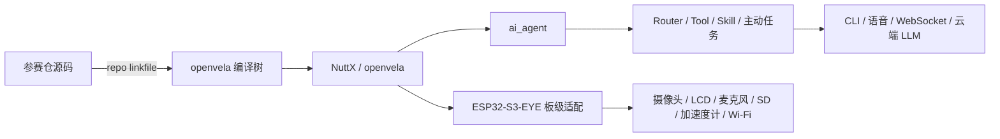

# 项目现状分析

## 初步方向

基于 ESP32-S3-EYE、openvela 与 ai_agent 构建“主动感知、主动决策、能够执行”的嵌入式 AI Agent，并以官方评分规则反向设计代码、测试、证据和展示材料。

## 当前架构

当前存在两个同名 Git 检出：

| 位置 | 角色 | 现场状态 |
|:---|:---|:---|
| `/Users/xingranya/Downloads/GitHub-clone/contest2026_130_xingshuangrenran` | 已停止使用的独立 clone | HEAD `1294cdf`；不参与 `<linkfile>`、`build.sh` 或日志采集 |
| `/Users/xingranya/Downloads/GitHub-clone/openvela-workspace/contest2026_130_xingshuangrenran` | 唯一开发目录、linkfile 实际源、本 SPEC 所在位置 | 同一 HEAD；15 个未提交文件已将 `team000` 改为 `team130`；规划文档已迁入 |

实际构建数据流为：

`Repo manifest -> repo-managed 参赛仓 -> linkfile -> openvela 编译树 -> build.sh`

T1.2 已依据官方流程确定 repo-managed 参赛仓为唯一开发目录。当前独立 clone 不再接收后续开发修改。

## 技术栈

| 层级 | 当前/目标技术 |
|:---|:---|
| 系统 | openvela、NuttX、Xtensa ESP32-S3 |
| 应用 | C、Kconfig、Make、CMake |
| UI | LVGL 240 x 240；按需使用 QuickApp UX/JSON |
| Agent | ai_agent、Router、Tool、Skills、cron、message bus |
| 云端 | MiMo 优先；通过适配器支持其他 LLM/ASR/搜索服务 |
| 构建 | Repo manifest、`build.sh`、defconfig、ESP-IDF 环境 |
| 部署调试 | esptool、USB-CDC NSH、USB-JTAG、OpenOCD/GDB |

## 入口与构建

- 统一构建入口：`../openvela-workspace/build.sh`。
- 当前应用入口：`app/hello_app/hello_app_main.c`，仅输出 Hello 文本。
- 当前板级入口：`board/contest_board/src/board_boot.c`，为 no-op 占位实现。
- Agent 入口：NSH 执行 `ai_agent` 后进入 `vela>`。
- 自定义 Skill 部署契约：`/data/agent/skills/*.md`。
- 固件产物：`nuttx/nuttx`、`nuttx/nuttx.bin`、`nuttx/nuttx.hex`。
- ESP32-S3-EYE 使用 simple-boot，平面镜像写入 Flash `0x0`。

官方文档存在两套构建描述：板卡 README 使用 `vendor/espressif/.../configs/openvela`，ai_agent 指引使用 `esp32s3-eye:ai_agent` 与 `fix_esp32s3.sh`。源码补齐后必须依据实际 defconfig README 冻结唯一流程，禁止混用。

## ESP32-S3-EYE 能力

- ESP32-S3 双核，8 MB PSRAM，8 MB Flash。
- OV2640 摄像头：`/dev/video0`。
- ST7789 LCD：`/dev/lcd0`。
- PDM 麦克风：`/dev/audio/pcm_in0`。
- microSD：`/dev/mmcsd1`。
- QMA7981 加速度计：`/dev/accel0`。
- Wi-Fi：`wlan0`；硬件支持 BLE 5，但当前 ai_agent 配置是否启用需真机验证。
- 无触摸；主要交互使用 5 个可编程按键、语音和屏幕反馈。

## 测试基线

- 参赛仓没有产品自动化测试，只有最低限度模板。
- openvela 全局测试存在，但没有 `contest2026_130` 专属回归。
- CodeGraph 已初始化，索引 44 个文件、677 个节点和 1284 条边；真正产品 C 文件仅 2 个。
- 既往 QEMU 示例可作为宿主环境参考，但不替代本轮 ESP32-S3-EYE 真机基线。

## 治理基线

- 仓内没有 `AGENTS.md`、`CLAUDE.md` 或既有 `docs/progress/总进度.md`。
- `.claude/` 与 `.codex/` 主要存放 Agent/Skill 配置，不是项目需求和进度的唯一事实源。
- 本轮以 `docs/比赛开发规格.md` 定义产品与验收，以 `docs/progress/总进度.md` 定义执行进度。
- GitHub CLI 已登录且具备 `repo` 权限，但缺少 `read:project`，自动检测为 `GITHUB_STANDARD`。本轮未获外部写入授权，因此不创建 Issue、Milestone 或 Project，采用本地进度跟踪。

## T1.3 恢复结果与剩余阻塞

- `packages/ai_agent`、`packages/apps`、`packages/demos`、`vendor/espressif` 已按赛事 manifest 定向恢复。
- Apple Silicon Xtensa GCC/G++/GDB、Ninja 与隔离的 esptool 环境已安装并完成烟测。
- ESP32-S3-EYE 板卡 defconfig、ai_agent defconfig 与 `fix_esp32s3.sh` 均已核对。
- 剩余阻塞是将上述工具整合为 macOS 构建/烧录入口，并完成真实固件构建与真机验证。

## S.U.P.E.R 基线

| 原则 | 状态 | 结论 |
|:---|:---:|:---|
| S 单一职责 | 黄 | app、quickapp、board 已分目录，但产品模块尚未形成 |
| U 单向流 | 黄 | manifest 到编译树方向清晰，业务事件流尚未设计 |
| P 接口优先 | 红 | 事件、Tool、记忆和动作结果均无显式契约 |
| E 环境无关 | 红 | 双副本、Linux 路径假设和缺失依赖导致环境不可复现 |
| R 可替换部件 | 黄 | linkfile 有利于替换，但 Agent、云和硬件边界尚未形成 |

整体为 **0/5 原则健康，技术债预警**。架构建设应早于功能堆叠。
