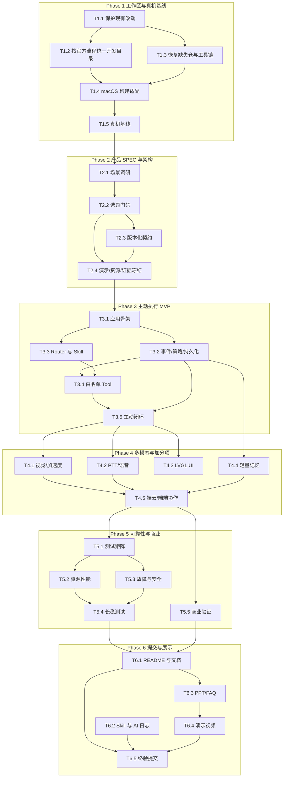

# 任务依赖图

## 关键路径

`T1.1 -> T1.3 -> T1.4 -> T1.5 -> T2.1 -> T2.2 -> T2.3 -> T3.1 -> T3.2 -> T3.4 -> T3.5 -> T4.1/T4.2/T4.4 -> T4.5 -> T5.1 -> T5.3 -> T5.4 -> T6.1 -> T6.3 -> T6.4 -> T6.5`

工作区恢复、产品选题、主动闭环和最终终验不可压缩；若进度落后，优先裁剪非核心通道，不能裁掉硬门槛、容错或提交证据。
