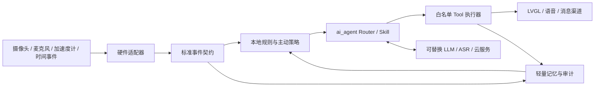

# openvela AI 硬件大赛高分开发 SPEC

> 状态：规划基线
> 创建日期：2026-07-12
> 目标截止：2026-09-20
> 目标硬件：ESP32-S3-EYE
> 技术主线：openvela + ai_agent + 多模态主动执行

## 1. 目标

在 ESP32-S3-EYE 真机上交付一个基于 openvela 与 ai_agent 的嵌入式 AI Agent。作品必须形成“感知或时间事件 -> 主动判断 -> Tool 执行 -> UI/语音/消息反馈 -> 结果留痕”的完整闭环，而不是普通聊天机器人。

内部目标分为三档：

- **保底目标**：满足赛道全部基础要求，真机稳定运行，可复现提交。
- **入围目标**：实现多模态、轻量记忆、端云协作和离线降级，有完整工程证据。
- **冲高目标**：按官方 100 分规则准备 90+ 分证据，技术、产品、商业和展示同步推进。

## 2. 当前产品假设

暂以“**多模态主动守护 Agent**”作为工作假设：利用摄像头、麦克风、加速度计、LCD 和 Wi-Fi 感知上下文，在特定事件或风险条件满足时主动提醒并执行任务。Phase 2 必须通过用户痛点、差异化、硬件利用率、开发风险和演示冲击力评分后，才能冻结最终场景与产品名称。

候选场景不得直接照搬天气助手、普通提醒器或 mini_memo；mini_memo 仅作为 ai_agent API 和工程架构参考。

## 3. 官方硬门槛

- 使用 `dev-ai-contest-2026` 分支的 openvela 与 ai_agent，在指定硬件上编译、烧录并运行。
- 配置 LLM 后端，至少接入 CLI、语音、WebSocket 中的一种交互渠道。
- 至少开发 1 个设备端自定义 Skill，部署到 `/data/agent/skills/` 并演示。
- 至少实现 1 个定时、阈值、事件或上下文型“主动 + 执行”场景。
- 必须使用 openvela 非 NuttX-only 能力，并落地图形、AI、多媒体至少一项；本项目目标为三项组合。
- 语音唤醒若启用，唤醒词必须为“你好，openvela”或“Hello，openvela”。
- 原创并遵循 Apache-2.0；服务端在赛事期间保持可用。
- 最终提交专属仓地址、代码、README、AI Coding 日志、作品介绍文档和不超过 5 分钟的演示视频。

## 4. 非目标

- 不交付纯云端应用、纯聊天机器人或只有界面没有设备动作的演示。
- 不把 no-op 的 `board/contest_board` 当成真实 ESP32-S3-EYE BSP。
- 不依赖触摸屏；ESP32-S3-EYE 无触摸硬件。
- BLE scan、uORB 加速度计和 SD 4-bit 在完成专项修复前不进入核心演示链。
- 不在两个同名参赛仓中并行开发，不通过手工复制维护两套源码。
- 不把开发期 Full Shell 权限带入最终固件；最终 Tool 必须白名单化。

## 5. 评分证据矩阵

| 评分项 | 分值 | 冲高策略 | 必须形成的证据 |
|:---|---:|:---|:---|
| 技术难度 | 30 | 摄像头/麦克风/加速度计/LCD 多模态；Router、Tool、cron、message bus 深度集成；端云任务拆分；资源裁剪与容错 | 架构图、关键源码、固件尺寸、峰值堆/栈、P50/P95 延迟、外设与故障恢复测试 |
| 产品创新 | 20 | 精确人群与高频痛点；无人输入也能完成主动闭环；硬件交互形成差异化 | 用户故事、竞品表、访谈记录、场景脚本、原型演示 |
| 项目完整度 | 20 | clean build、真机稳定、重启持久化、断网降级、测试矩阵和维护文档 | README、自动/手动测试、30-60 分钟 soak、冷启动/断网/重启记录 |
| AI 开发 | 10 | AI 覆盖需求、设计、编码、测试、调试、文档；另沉淀至少 1 个可复用开发 Skill | 合规 `logs/`、开发 Skill、效率前后对比、AI 决策复盘 |
| 商业潜力 | 10 | 明确客户、付费方、部署成本、隐私边界、量产路径和传播计划 | 成本表、市场验证、用户反馈、路线图、传播数据 |
| 展示效果 | 10 | 5 分钟内展示痛点、真机主流程、技术难点、容错指标和商业价值 | PPT、主录像、离线备用录像、答辩 FAQ、逐秒演示脚本 |

## 6. 目标架构

全局采用 S.U.P.E.R 约束：

- **S**：采集、规则、路由、执行、UI、持久化、云通道分模块。
- **U**：输入到输出单向流动，领域核心不反向依赖 LVGL 或云 SDK。
- **P**：事件、意图、Skill 输入输出、Tool 结果和记忆记录均定义可序列化契约。
- **E**：Key、端点、SSID 和平台路径通过配置注入；macOS/Linux 使用构建适配器。
- **R**：LLM、ASR、通道和传感器均可替换、可 mock；云端不可用时本地核心路径仍可运行。

## 7. 全局验收标准

- 从固定提交和工具链版本，在 macOS 上完成 clean build、烧录和首次启动。
- `ls /dev` 与外设烟测通过；关键设备节点及失败行为有记录。
- 自定义 Skill 可发现、可调用，Tool 产生真实且安全的设备副作用。
- 无人输入时能主动触发，执行结果通过 UI、语音或消息渠道反馈。
- 主动任务重启后恢复；断网、API 超时、daemon 掉线、存储异常时可解释降级且不崩溃。
- 最终固件不泄露 Key，不开放任意 Shell；日志、摄像头和录音满足隐私告知。
- 每个评分点均能定位到源码、测试、指标和演示时间码。

## 8. 文档入口

- [官方开发流程](./官方开发流程.md)
- [项目现状](./analysis/项目现状.md)
- [模块盘点](./analysis/模块盘点.md)
- [风险评估](./analysis/风险评估.md)
- [任务分解](./plan/任务分解.md)
- [依赖关系](./plan/依赖关系.md)
- [里程碑](./plan/里程碑.md)
- [进度总表](./progress/总进度.md)
